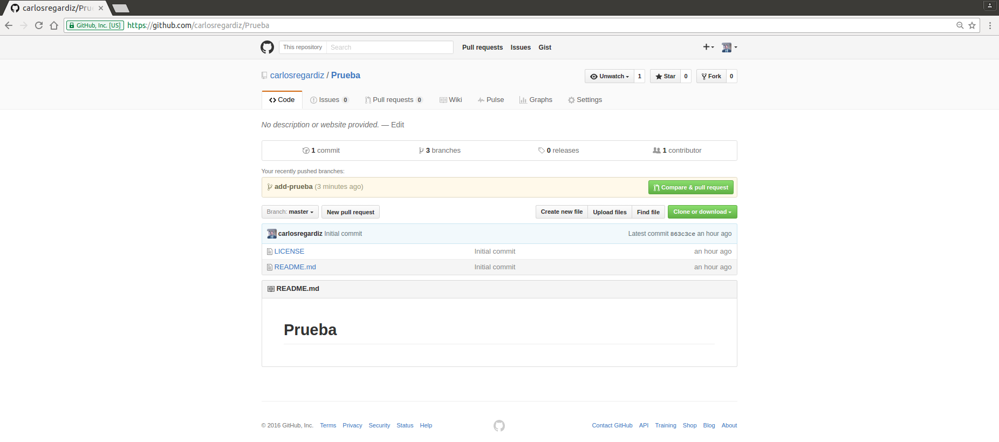

## **
Aprendiendo a usar GIT**

#### *
Antes de incursionar en el mundo del GIT, debes crear una cuenta en algun servidor de GIT, te recomiendo [GITHUB](https://github.com).*

Una vez creada la cuenta en github, deben hacer clic en *create new*  (o "+" que se puede observar en la parte superior derecha) y darle a la opcion *new repository* para crear el nuevo repositorio.

En la siguiente ventana se deben rellenar los datos.

Los repositorios siempre deben ser **Public**, inicializar con un archivo **README** y el tipo de licencia que se usara es la **MIT**. Y luego hacer clic en **Create repository**.

Luego de haber creado el repositorio, el sistema nos mostrara el nuevo repositorio, para trabajar con nuestro sistema de manera remota es necesario clonar el repositorio a nuestro entorno local, para ello debemos copiar la URL en **Clone o download** haciendo clic en la opcion **copy to clipboard**.

Abrimos nuestro terminal y nos preparamos para clonar nuestro repositorio (no olvides desplazarte a la carpeta donde quieres que este).

    git clone (URL copiada)

Se mostrara la descripcion de los objetos creados.

Ejecutamos

    ls

y nos mostrara los archivos README y LICENSE.

Hacemos.

    git branch
y nos mostrara las ramas de nuestro repositorio (en este punto deberia estar solo **Master**), es por ello que debemos crear otra rama (la rama develop).

    git branch develop

Hacemos.

    ls
y confirmamos que este la rama develop creada.

Nos movemos a la rama develop.

    git checkout develop

Hacemos.

    git branch

Para confirmar

La rama sobre la cual vamos a trabajar es develop (nunca debemos tocar la rama **Master**).
Creamos una nueva rama.

    git branch add-prueba

Confirmamos que haya sido creada.

    git branch

Nos vamos a la nueva rama creada.

    git checkout add-prueba

Confirmamos que nos cambiamos de rama.

    git branch

Listamos los archivos.

    ls

Abrimos el editor de texto (en nuestro caso **ATOM**)

    atom .

y nos mostrara el README de nuestro repositorio

Hacemos los cambios pertinentes al archivo, guardamos y cerramos.

Revisamos el estatus de nuestro repositorio.

    git status

y a;adimos el README.

    git add README.md

hacemos commit para revisar los cambios.

     git commit README.md
![imagen 1][1] ![imagen 2][2]

[1]: Images/img23.png
[2]: Images/img24.png

Ejecutamos.

    git commit -m "modificacion de README"
Indicara los cambios que se han agregado en el documento.

Agregamos nuestro nombre de usuario en github y contrase;a.

Abrimos el navegador y nos dirijimos a github.

Damos click en la opcion que dice Compare y pull

Abrira una ventana que dice **Open a pull request** comparamos los cambios en la parte inferior de la pantalla.

Debemos colocar en la base **develop** y en compare **add-prueba**.  Hacer clic en **Create pull request**

En la ventana siguiente hacemos clic en **Merge pull request** (siempre y cuando la base sea **develop** y compare con **add-prueba**)

Hacemos clic en **Confirm merge**

Borramos la rama add-prueba en **Delete branch**

Y listo, ya se hicieron los cambios en el servidor.

Volvemos al terminal y nos dirigimos a la rama develop, para sincronizar lo que tenemos en el servidor con nuestro equipo.

    git checkout develop

    git pull origin develop

corroboramos que estamos en la rama develop

    git branch develop

Borramos la rama add-prueba.

    git branch -D add-prueba

Revisamos que se haya borrado la rama.

    git branch

Y listo!! bienvenido al mundo de GIT.
